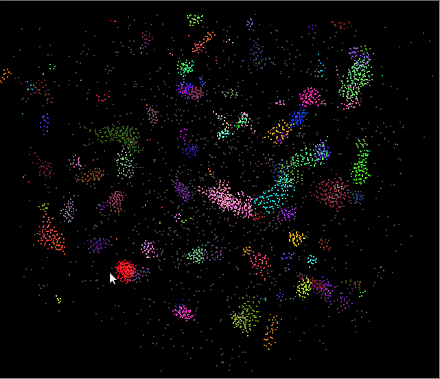
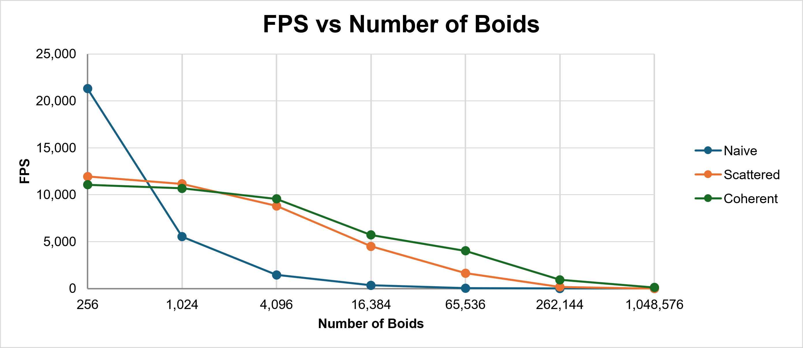
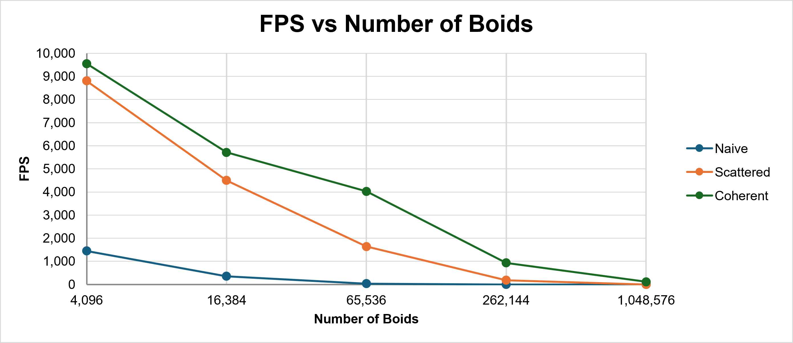
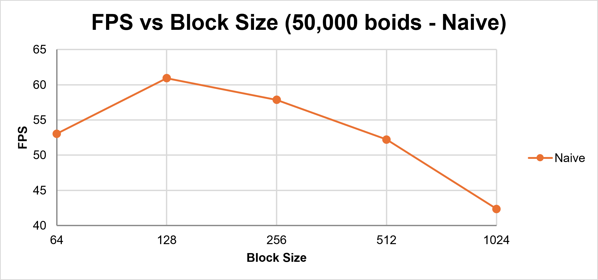
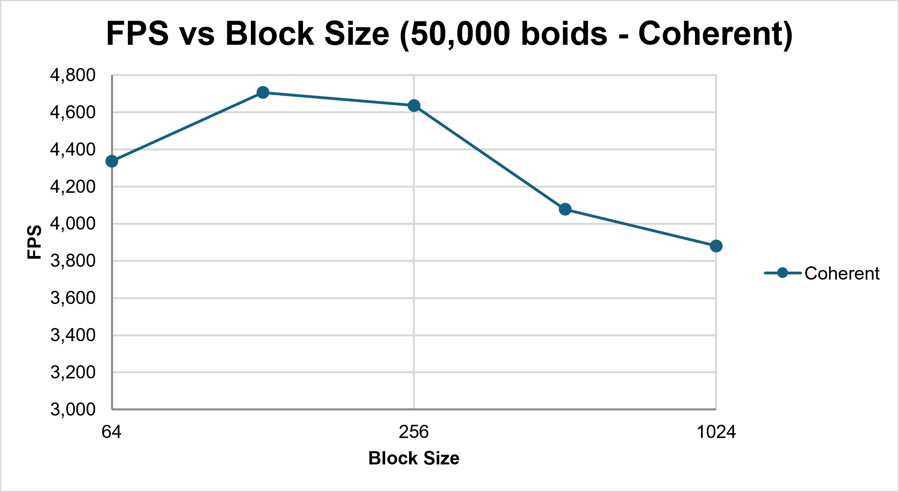
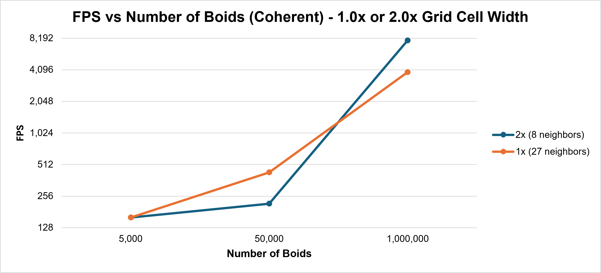

**University of Pennsylvania, CIS 5650: GPU Programming and Architecture,
Project 1 - Flocking**

* Ryan Morris
  * [LinkedIn](www.linkedin.com/in/r19)
* Tested on: Windows 11, Intel i7-12700H @ 2.3GHz 64GB, GeForce RTX 3070 Ti Laptop GPU 8GB

**Note for graders**: Submission version for grading 9/7 11:59PM (1 late day used)

Include screenshots, analysis, etc. (Remember, this is public, so don't put
anything here that you don't want to share with the world.)

## Performance Analysis (Wip)

### Number of Boids

As is expected, increasing the number of boids has an inverse impact on the performance. There are many more particles which have to be searched in the search space to determine each update. In the Naive version, this impact is worse because all N boids must be searched regardless. The scattered grid and coherent grid versions reduce this search space, meaning that the number of boids it takes before overwhelming the number of sequential calculations each GPU thread has to complete is reduced. Let's take a look at the below graph:

**FPS vs. boid count (avg. over 1000 iterations, first 100 iterations excluded)**

| Boids | Naive fps | Scattered fps | Coherent fps |
|------:|------:|----------:|---------:|
| 256 | 21,310 | 11,941 | 11,062 |
| 1,024 | 5,527 | 11,164 | 10,687 |
| 4,096 | 1,452 | 8,808 | 9,552 |
| 16,384 | 356 | 4,500 | 5,717 |
| 65,536 | 37.0 | 1,640 | 4,027 |
| 262,144 | 2.6 | 186 | 936 |
| 1,048,576 | 0.2 | 3.1 | 119 |

Note: Measurements below 5fps were not run to completion and relied on the GUI fps measurement.

When there is very few boids (the lowest I tested was at 256), the overhead of the additional work in grid cell calculations and sorting by grid indices dominates, and the Naive approach of running a distance check on each boid is roughly double the framerate. 

From 1,024 boids through to 16,384 or so, Naive can still manage a good framerate 

At 65,536 boids the Naive implementation begins to struggle to complete 1000 iterations in a timely fashion, and the framerate was measured using only the FPS indicator at higher numbers of boids due to this. Scattered starts to be too slow at 262,144 boids, and Coherent can work at ~1M (1,048,576) before slowing down. This shows that at large scale, both the initial grid optimization and the coherent ordering of the grid buys roughly 4x boid increase each for similar levels of performance (rough eyeballing).

The grid speedup is partially attributable to the proportion of boids that are located in the neighboring grids with the default settings 8 * (2r)^3 = 64r^3, where r is 5 (the largest boid rule distance). The total area is (20r)^3 (side length of 100). This is a 125x increase.

The coherent grid speedup over the scattered grid is noticable at >= 4,096 boids. This is due to improvements in memory locality, when the indirect `particleArrayIndices` buffer is used, a warp pulls and discards a separate cache line on each access. At smaller number of boids, the entire dataset could fit in L2 memory and the reshuffling itself is an overhead that makes the coherent version a touch slower.

Zooming in on the tail:

### Block Size

**FPS vs Block Size** 

| Block size | Naive | Coherent |
|-----------:|------:|---------:|
| 64 | 53.0 | 4,337 |
| 128 | 60.9 | 4,706 |
| 256 | 57.9 | 4,635 |
| 512 | 52.2 | 4,078 |
| 1,024 | 42.4 | 3,881 |

Note: All simulations were ran for 1,000 steps after discarding the first 100. The number of boids was set to 50,000 for each.

 

We notice that in the block sizes test, the peak under both implementations was at 128. A smaller block size of 64, I suspect, has worse memory locality which causes it to perform slightly worse. On the flip side, further increasing the block size towards the maximum of 1,024. This has to do with the number of blocks that can fit in each SM; it may be the case that larger blocks can't fit into each SM as evenly, causing wasted space on each SM at larger block sizes.

### Grid Size

Another experiment I ran was changing the grid size in the grid-based solutions. The two options were the default of 2x the neighborhood distance (logically requiring 8 adjacent grid cells to be checked based on the octant we are in), and 1x the neighborhood distance (requiring all 27 surrounding grid cubes to be checked). The results of this experiment are as follows

At 5,000 boids, there is no discernable difference between the two settings. Likely there is a similar amount of boids captured in the neighborhood bound in both. At 50,000 bounds, the version with less (but larger) adjacent grid cubes performed better. This may be due to the memory overhead per cube on the coherent implementation. At 1,000,000 boids, the smaller cubes of 1.0x the neighborhood distance prevailed, despite having to check 27 of them, because these cubes are 8x the area (and thus contain in expectation 8x the boids) but there are only ~3x more to check. 

### Bloopers

